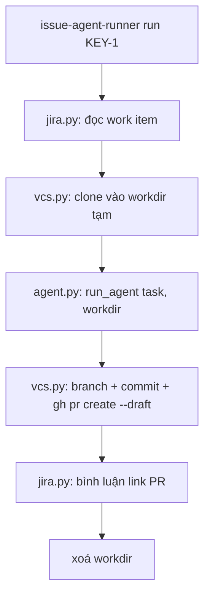

# Design: issue-agent-runner (tsubame) - as-built

- **Project:** tsubame   **Status:** AS-BUILT
- **Date:** 2026-08-19   **Hiện thực hoá spec:** ./spec.md

## 1. Tổng quan

Một CLI Python ~410 dòng, không dịch vụ nền, không trạng thái. Toàn bộ chương trình là một đường
thẳng; mọi tính linh hoạt dồn vào **một điểm nối duy nhất** là hàm `run_agent`.



## 2. Thành phần

| Tệp | Trách nhiệm | KHÔNG sở hữu |
|---|---|---|
| `cli.py` | tuần tự các bước, xử lý lỗi ở mức người dùng | không biết chi tiết tracker hay VCS |
| `config.py` | đọc biến môi trường, giá trị mặc định | không giữ bí mật trong code |
| `jira.py` | đọc work item + bình luận qua REST | không đụng git |
| `vcs.py` | clone, branch, commit, `gh pr create --draft` | không sinh nội dung thay đổi |
| `agent.py` | điểm nối `run_agent`; mặc định gọi subprocess | không quyết định quy trình xung quanh |
| `examples/api_key_agent.py` | bản tham chiếu gọi thẳng API model (~30 dòng) | - |
| `echo_agent.sh` | backend demo, ghi một thay đổi giữ chỗ | - |

## 3. Điểm nối agent

```python
def run_agent(task: str, workdir: str) -> None:
    ...
```

Hợp đồng: cho một mô tả công việc và một thư mục, hãy sửa tệp trong đó. Mọi thứ quanh nó (đọc
tracker, clone, branch, PR, bình luận) không đổi. Ba cách dùng:

| Cách | Khi nào |
|---|---|
| subprocess (mặc định) | có sẵn CLI agent riêng - chỉ cần đặt biến môi trường, không sửa code |
| `examples/api_key_agent.py` | muốn thấy đường gọi API bằng khoá của chính mình |
| `echo_agent.sh` | chạy thử toàn tuyến, $0, không agent thật |

## 4. Quyết định kỹ thuật

- **D-001: một hàm, không registry.** Registry/plugin discovery là chi phí đọc hiểu mà dự án tham
  chiếu không nên bắt người đọc trả. Phục vụ FR-003, SC-001, SC-002.
- **D-002: subprocess làm mặc định.** Nó không ràng buộc người dùng vào nhà cung cấp nào - bất cứ
  thứ gì sửa được tệp trong `workdir` đều dùng được. Phục vụ FR-004.
- **D-003: luôn dừng ở draft PR.** Agent viết code là để người xem lại, không phải để tự merge.
  Phục vụ FR-005.
- **D-004: `gh` CLI thay vì gọi thẳng API GitHub.** Tận dụng xác thực sẵn có của người dùng, ít
  đường xử lý token hơn trong repo công khai.
- **D-005: workdir dùng một lần và xoá.** Không trạng thái ⇒ chạy lại luôn sạch, và không giữ mã
  nguồn của người khác trên máy. Phục vụ FR-007, SC-004.
- **D-006: có sẵn backend demo.** Người đọc chứng thực được toàn tuyến trước khi cắm agent thật -
  đây là điều làm nó thành *reference* chứ không phải *khung sườn*. Phục vụ SC-003.
- **D-007: ví dụ trung lập.** Repo công khai nên dùng `owner/example-repo`, `KEY-1`; không dấu vết
  công ty, khách hàng hay hạ tầng nội bộ.

## 5. Cấu hình

`.env.example` liệt kê: base URL + token của tracker (quyền đọc + bình luận), token GitHub (contents
+ PR write), và lệnh backend agent. Tài liệu nhấn mạnh token quyền tối thiểu.

## 6. Cài đặt và chạy

```bash
cp .env.example .env
pip install -e .
issue-agent-runner run KEY-1
```

Cần `git` + `gh` trên PATH, đã đăng nhập cho repo đích.

## 7. Truy vết

| Thành phần | Phục vụ |
|---|---|
| jira.py | FR-001, FR-006 |
| vcs.py | FR-002, FR-005 |
| agent.py + examples | FR-003, FR-004, SC-002, SC-003 |
| cli.py (dọn dẹp) | FR-007, SC-004 |
| config.py + .env.example | FR-008 |
